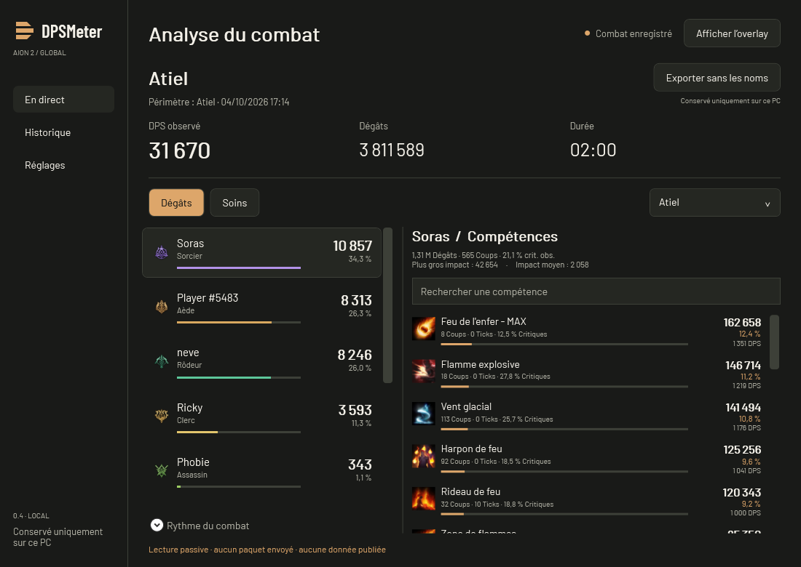

<p align="center">
  <picture>
    <source media="(prefers-color-scheme: dark)" srcset="brand/logo-dark.svg">
    <source media="(prefers-color-scheme: light)" srcset="brand/logo-light.svg">
    
  </picture>
</p>

<h1 align="center">Your combat, clearly.</h1>

<p align="center">
  <strong>Your DPS meter for AION 2 Global.</strong><br>
  Track damage and healing in game, explore your skills, and revisit your fights.
</p>

<p align="center">
  Windows x64 · English / French / Spanish · 3 themes · Local history
</p>

<p align="center">
  <a href="#installation">Install</a> ·
  <a href="#preview">See the interface</a> ·
  <a href="#skill-breakdown">Skill breakdown</a> ·
  <a href="#your-first-fight">Your first fight</a> ·
  <a href="#frequently-asked-questions">FAQ</a> ·
  <a href="https://github.com/Phobie53/DPSMeter/issues">Report an issue</a>
</p>

---

## Preview

### In-game ranking

**During combat, see what matters without leaving the game.** The discreet overlay shows one row per observed player, with DPS and damage share. Its height fits the ranking, and abbreviated values keep it readable. Hover over a player to see total damage, observed critical hits, and their top skills.

<p align="center">
  
</p>

### Skill breakdown

**Click a player to replace the ranking with their skills.** Each row shows the skill's DPS and its share of that player's damage. Use **←** to return to the ranking. The total at the bottom still covers all observed participants.

<p align="center">
  
</p>

**Click a skill or Report to open the full analysis.** The selected player and target scope carry over from the overlay. In the app, selecting another player updates the **Skills** panel; use the search field to find a skill by name.



*Original screenshot from an earlier version, kept in French with the original player names. It shows a real fight and the game's skill icons.*

| Per-skill metric | What the report shows |
| --- | --- |
| **Damage** | Total damage dealt by this skill within the selected scope, including ticks. |
| **Share (%)** | This skill's share of the selected player's damage. |
| **DPS** | The skill's damage divided by the fight duration used for the selected scope. |
| **Hits** | Observed impacts excluding ticks; this is not a cast counter. |
| **Ticks** | Periodic events counted separately from direct hits. |
| **Critical hits (%)** | The proportion of observed hits that were critical, excluding ticks. |

In the report above, **Feu de l'enfer - MAX** deals **162,658 damage**, accounting for **12.4%** of Soras's damage and **1,351 DPS**. Its **12.5% critical rate** applies to the skill's 8 hits, not its share of total damage.

The summary above the skills shows the player's damage, hits, critical rate, **Largest event**, and **Average event** within the displayed scope. The last two values include ticks. Switch to **Healing** for the same breakdown using raw healing and HPS. Expand **Fight timeline** to chart all observed participants or the selected player.

### Revisit a fight

**History keeps your reports on your PC.** Search for a boss or player, filter for boss fights, then double-click a fight or select **Full report** to revisit its ranking and skills. You can browse a saved fight while capture continues.

<details>
<summary><strong>See the history view</strong></summary>


</details>

> The overlay and history previews use **fictional demonstration data**, rendered in English from version **0.4.13** with the Graphite theme. The Atiel report is an original French screenshot of a real fight, published with permission. None of these screenshots should be used to compare class performance.

| During your session | When reviewing your performance |
| --- | --- |
| **DPS and HPS** — damage and healing per second | **Skills** — contribution, hits, ticks, and observed critical hits |
| **Boss or all targets** — choose your scope | **Fight timeline** — chart all observed participants or one player |
| **Discreet overlay** — compact, movable, with click-through mode | **History** — search by boss or player and filter boss fights |
| **Three themes** — Graphite, Ivory, High contrast | **Import / export** — JSON v2 files, export without names |
| **Automatic collapse** — title bar only after two minutes out of combat | **Copy** — a compact summary in the interface language, ready for game chat |

## Installation

### Requirements

- **Windows x64** and AION 2 Global.
- **Npcap** to read combat events. The first-launch setup guides you if it is missing; it is installed separately, once per PC.
- Run the game in **windowed or borderless mode** to keep the desktop overlay visible on top.

The executable is self-contained: **you do not need to install .NET to use it**.

### Download and launch

1. Download **DPSMeter.exe** from the [latest release](https://github.com/Phobie53/DPSMeter/releases/latest) and save it in a personal folder.
2. Open the executable. If Npcap is missing, setup asks you to close the game and download the installer from the official website.
3. Install Npcap, return to DPSMeter, click **Check installation**, then **Continue**. Launch the game afterward.

Already have Npcap? Setup is skipped. **Later** lets you browse saved fights and settings without capture; **Start** reopens setup if Npcap is still missing. Detecting the driver alone does not guarantee that combat events are being received.

The app is not yet signed, so Windows may display a security warning. Check that the file comes from this repository.

<details>
<summary><strong>Automatic updates: version 0.4.6 and later</strong></summary>

Starting with version 0.4.6, the app checks for stable releases on launch, downloads them in the background, and installs them the next time you launch it. No restart is forced; your fights and preferences are preserved.

Users of version 0.4.5 or earlier must update manually once, as those versions have no updater. Installing updates requires a writable folder. The meter remains usable without a network connection or an available release.

</details>

## Your first fight

1. **Launch DPSMeter.** Capture and the overlay start automatically with the default settings. You do not need to restart the game.
2. **Play normally.** Data appears as combat events arrive. Choose **DPS** or **HPS**, and **Boss** or **All** targets in the overlay.
3. **Explore a row.** Hover for a summary; click to see the player's skills. Click a skill or **Report** to open the detailed analysis.
4. **Revisit your fight.** When combat goes idle, the fight is saved in **History**. In the open world, the timeout is 12 seconds without relevant personal activity when your character is identified; nearby farming does not extend it. For an engaged boss, participants' damage to that boss keeps the fight active, and resuming after a quiet phase updates the same saved fight. Capture continues while you read an older report.

In **Settings**, choose your language, theme, and optionally your character name. The name takes effect the next time capture starts.

### Overlay controls

| To… | Do this |
| --- | --- |
| Show or hide the meter | Press **`Ctrl+Alt+M`**, or use **Show / Hide overlay** in the app |
| Move it | Drag the title bar; hold **Shift** to temporarily bypass edge snapping |
| Resize it | Drag the bottom-right corner; double-click the title for compact mode |
| Click through to the game | Enable the **◇** lock; hide and show the overlay with **`Ctrl+Alt+M`** to unlock it |
| Reposition it | Open **···** for corner and center positions, or **Settings → Bring overlay here** |
| Browse a saved fight | Open the overlay's **Live ▾** menu |
| See a player's skills | Click their row; **←** returns to the ranking |
| Open the damage breakdown | From the skill list, click a row or **Report** |
| Copy a fight summary | Click **Copy** in the overlay or report |

Position and size are remembered. By default, the overlay fades to **15% opacity out of combat** when the fight goes idle after the 12-second timeout. It becomes readable again during combat or on hover when unlocked. Saved fights stay readable. Change this in **··· → Nearly transparent out of combat**.

After **two minutes out of combat**, the overlay collapses to its title bar. Hovering does not expand it: use the arrow button for another two minutes of reading, or let the next fight restore its size. Saved fights remain expanded. You can also turn off **Discreet layout** in **···** to return to detailed rows.

## Understanding your numbers

**DPS depends on the selected target.** For a boss, it uses the time between players' first and last damage to that boss, with a minimum of one second. Waiting for the 12-second inactivity timeout does not lower the result. Pauses between attacks still count. With all targets selected, the calculation uses the segment's first and last event.

- **Healing:** raw values, without subtracting overhealing. HPS therefore does not measure effective healing alone.
- **Critical hits:** observed statistics; other players' data may be incomplete.
- **Ticks:** their damage counts without inflating the hit count or critical rate.
- **Participants:** players identified in received traffic, not a confirmed party roster. Names or HP may be missing.
- **Unidentified sources:** some anonymous sources remain separate from players. Their damage still counts, and their details remain available; ownership is never guessed.

Buffs, buff uptime, back/front attacks, double hits, and perfect hits are not yet exposed. Without an identified boss, 12 seconds without relevant activity may split an encounter into separate fights. For a boss, a missed death or reset event may instead merge attempts; a full HP recovery mechanic may be mistaken for a reset. Boss continuation does not survive restarting the meter. Game updates may require decoder changes.

## Frequently asked questions

### No damage appears. What should I check?

Check that Npcap is installed, capture is not paused, and combat events are occurring. Look at the capture status in the app. If the problem persists, [report an issue](https://github.com/Phobie53/DPSMeter/issues/new?template=bug_report.md) with your app version and the displayed message, without private data.

### Why are some player or boss names missing?

If the meter starts mid-session, it may need to wait for the game to send their identity again. Received damage is kept without inventing missing information.

### Where are my fights stored?

They stay on your PC in `%LOCALAPPDATA%\DPSMeter\fights\`. Preferences are in `%LOCALAPPDATA%\DPSMeter\settings.json`. Fights are not automatically deleted; a very large collection may take longer to load.

### Can I share a report?

Yes. **Copy**, in the overlay or report, puts a compact line on your clipboard with the target, duration, overall DPS or HPS, and ranking. It follows the displayed filter and interface language. Values are abbreviated as k/M, and player names are retained. Paste it into game chat yourself.

To share the full file, **Export without names** creates a JSON v2 file with player names and identifiers replaced. You choose where to share it; DPSMeter does not upload it. Local saves retain names. Import accepts this project's v2 format and marks imported fights as unverified; NotMeter files and the legacy v1 prototype format are not supported.

### What do Pause and New fight do?

**Pause** ignores events received while paused; they will not be replayed. **New fight** saves the current segment; the next segment starts when qualifying combat activity resumes.

### Is this an official tool or approved by NCSOFT?

No. DPSMeter is an **independent project** and does not claim NCSOFT approval. It uses passive capture through Npcap: no injection, game-memory access, packet modification, gameplay automation, or protection bypass. This method does not guarantee compliance with the game's rules.

### Is my data sent over the Internet?

**No telemetry or automatic fight uploads.** The app does not store raw packets, IP addresses, or game account details. The updater introduced in version 0.4.6 contacts GitHub for release information and downloads, without sending combat data. There is no integrated community website or online leaderboard.

## Contributing

Found a problem or have an idea? [Open an issue](https://github.com/Phobie53/DPSMeter/issues). Include your app version, what you expected, and what you observed. Do not attach real fights, raw network traffic, or screenshots containing private information.

<details>
<summary><strong>Developers: documentation and verification</strong></summary>

Requirements: Windows and the .NET 9 SDK. An LTS migration is still to be planned.

Read the [handoff guide](docs/HANDOFF.md) and [contribution guide](CONTRIBUTING.md) before changing the project. These supporting documents are currently in French.

```powershell
powershell -NoProfile -File tools/Verify.ps1
```

This script restores locked dependencies, builds the app, checks calculations and protocol behavior, publishes the executable, and renders the interface offscreen in all three languages and themes. It does not start capture or interact with the game. Results stay in `artifacts/`, which is ignored by Git. These checks do not certify the entire protocol.

- [Architecture](docs/ARCHITECTURE.md)
- [JSON v2 fight format](docs/FORMAT.md)
- [Technical decisions](docs/DECISIONS.md)
- [Brand identity and assets](brand/README.md)
- [Automated checks on GitHub](https://github.com/Phobie53/DPSMeter/actions/workflows/build.yml)

</details>

---

Project code is under the [MIT license](LICENSE). AION 2 artwork and data: © NCSOFT, excluded from the project's MIT license. The engine is derived from SkeeveTV's work under MIT; PacketDotNet is under MPL-2.0, and Barlow fonts under SIL OFL 1.1. See [third-party notices](THIRD-PARTY-NOTICES.md) and [engine provenance](src/DPSMeter.Engine/Vendor/ORIGIN.md).
