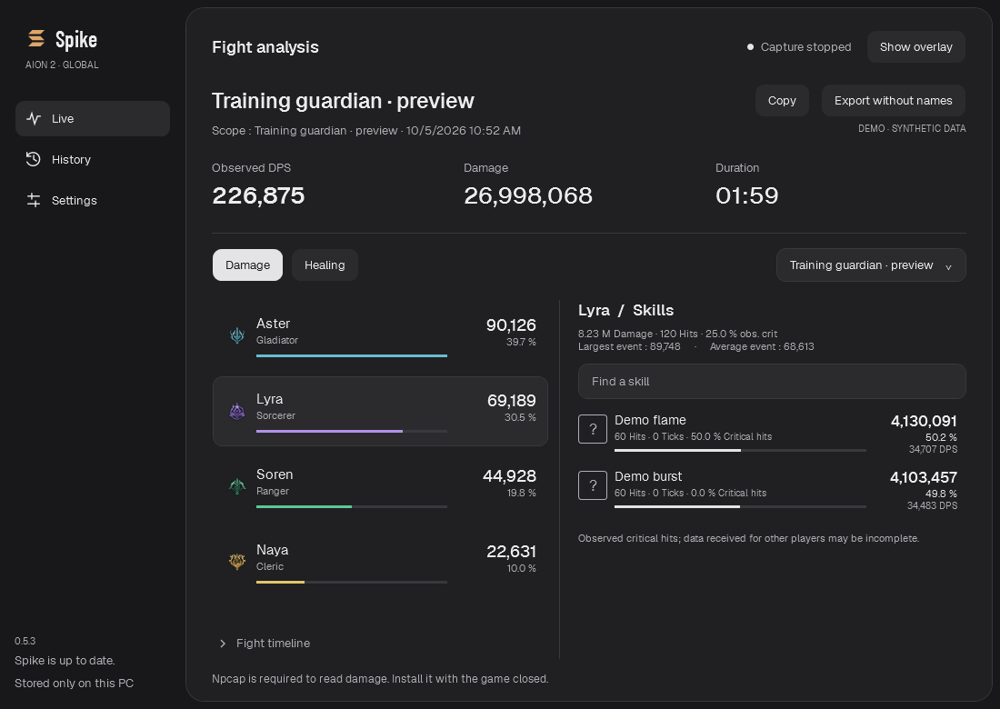
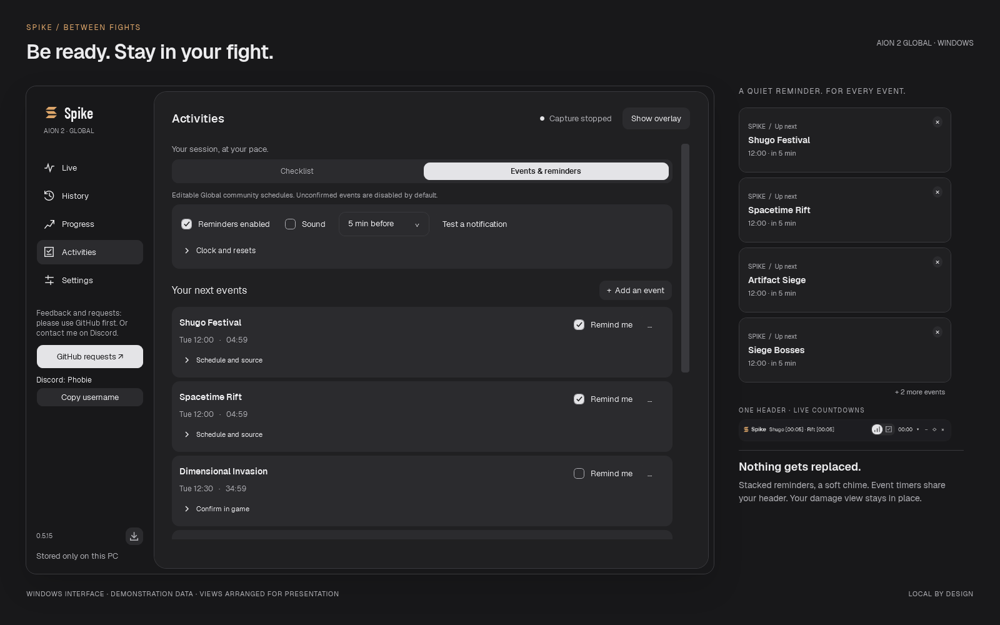
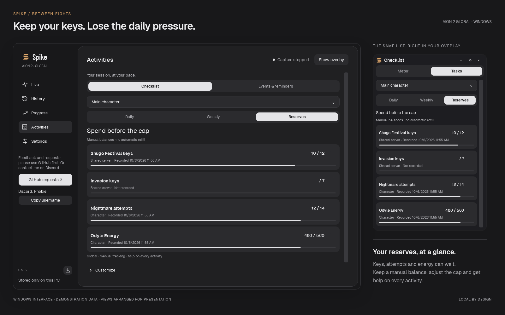

**Spike — AION 2 Global combat meter.** [Visit the website](https://enzocx.github.io/Spike/) · [Download for Windows](https://github.com/EnzoCx/Spike/releases/latest/download/Spike.exe)

<p align="center">
  <picture>
    <source media="(prefers-color-scheme: dark)" srcset="brand/logo-dark.svg">
    <source media="(prefers-color-scheme: light)" srcset="brand/logo-light.svg">
    
  </picture>
</p>

<h1 align="center">Your combat, clearly.</h1>

<p align="center">
  <strong>Your DPS meter for AION 2 Global.</strong><br>
  Track damage and healing, plan your next event, and keep your daily goals in view.
</p>

<p align="center">
  Windows x64 · English / French / Spanish · 3 themes · Local history
</p>

<p align="center">
  <a href="#installation">Install</a> ·
  <a href="#preview">See the interface</a> ·
  <a href="#skill-breakdown">Skill breakdown</a> ·
  <a href="#events-and-checklist">Events & checklist</a> ·
  <a href="#feature-comparison">Compare meters</a> ·
  <a href="#your-first-fight">Your first fight</a> ·
  <a href="#frequently-asked-questions">FAQ</a> ·
  <a href="https://github.com/EnzoCx/Spike/issues">Report an issue</a>
</p>

---

## Preview

### In-game ranking

**During combat, see what matters without leaving the game.** The discreet overlay shows one row per observed player, with DPS and damage share. Its height fits the ranking, and abbreviated values keep it readable. Hover over a player to see total damage, observed critical hits, and their top skills.

<p align="center">
  
</p>

### Skill breakdown

**Click a player to replace the ranking with their skills.** Each row shows the skill's DPS and its share of that player's damage. Use **←** to return to the ranking. The total at the bottom still covers all observed participants.

<p align="center">
  
</p>

**Click a skill or Report to open the full analysis.** The selected player and target scope carry over from the overlay. In the app, selecting another player updates the **Skills** panel; use the search field to find a skill by name.



*The current combat report, with catalog skill icons and fictional players and combat values.*

| Per-skill metric | What the report shows |
| --- | --- |
| **Damage** | Total damage dealt by this skill within the selected scope, including ticks. |
| **Share (%)** | This skill's share of the selected player's damage. |
| **DPS** | The skill's damage divided by the fight duration used for the selected scope. |
| **Hits** | Observed impacts excluding ticks; this is not a cast counter. |
| **Ticks** | Periodic events counted separately from direct hits. |
| **Critical hits (%)** | The proportion of observed hits that were critical, excluding ticks. |

Damage share and critical rate measure different things: a skill can account for half of a player's damage without half of its hits being critical.

The summary above the skills shows the player's damage, hits, critical rate, **Largest event**, and **Average event** within the displayed scope. The last two values include ticks. Switch to **Healing** for the same breakdown using raw healing and HPS. Expand **Fight timeline** to chart all observed participants or the selected player.

### Revisit a fight

**History keeps your reports on your PC.** Search for a boss or player, filter for boss fights, then double-click a fight or select **Full report** to revisit its ranking and skills. You can browse a saved fight while capture continues.

<details>
<summary><strong>See the history view</strong></summary>


</details>

> All previews use **fictional demonstration data**, rendered in English with the Graphite theme. The report and overlay previews show version **0.5.15**, with actual catalog skill names and icons. They should not be used to compare class performance.

| During your session | When reviewing your performance |
| --- | --- |
| **DPS and HPS** — damage and healing per second | **Skills** — contribution, hits, ticks, and observed critical hits |
| **Boss or all targets** — choose your scope | **Fight timeline** — chart all observed participants or one player |
| **Discreet overlay** — compact, movable, with click-through mode | **History** — search by boss or player and filter boss fights |
| **Three themes** — Graphite, Ivory, High contrast | **Import / export** — JSON v2 files, export without names |
| **Automatic collapse** — title bar only after two minutes out of combat | **Copy** — a compact summary in the interface language, ready for game chat |

- **Checklist & reserves** — daily and weekly goals, keys and Odyle, shared between the app and overlay.
- **Event timers & alerts** — Shugo / Rift countdowns in the overlay header and configurable, stacked reminders.

## Events and checklist

**Your session, at your pace.** Open **Activities** to see upcoming events and keep track of daily and weekly goals. The overlay’s **Meter / Tasks** tabs switch views without interrupting capture (**Ctrl+Tab** also works).

### Be ready for the next event

Choose **Activities → Events & reminders**, enable notifications and select your events. Set a reminder from **0 to 60 minutes before**, optionally add sound, then use **Test a notification**. Upcoming times display in your local time zone. Compact reminders stack at the **top right** of the overlay’s monitor (or the main window’s monitor). Each card stays for 12 seconds; hovering pauses the stack. Additional events queue without replacing existing reminders.



*Windows interface preview with synthetic event times.*

Shugo and Rift presets are included, alongside community schedules for Artifact Siege and siege bosses. Nahma, Kaira and Dimensional Invasion are marked **Confirm in game**, with reminders off by default. Edit any event’s times and weekdays, or add your own. Notifications start disabled; no account or network connection is needed.

**Spike stays in the system tray.** Closing the main window keeps your overlay, capture and reminders running. Double-click its tray icon to reopen Spike; the tray menu controls the main window and overlay independently. **Quit Spike** exits completely. Reminders also work with capture stopped or the overlay hidden. Use windowed/borderless mode: exclusive fullscreen may hide desktop notifications. A delayed or missed event is not replayed after a long sleep.

### Make the checklist yours



*Windows interface preview with synthetic balances. Both views share one local save.*

Reserve controls use **±1** for keys/attempts and **±40** for Odyle. Click the balance to enter an exact value. Weekly Wind Breeze purchases are tracked separately: **4 per character + 16 per server**, with help and the [Global item source](https://aion2.gaming.tools/items/503700031).

Spike starts with **only the overlay visible**; open the main window by double-clicking its system tray icon. The header includes compact event countdowns such as **Shugo [00:42] · Rift [02:42]** (hours:minutes), alongside the combat controls. Toggle them with **··· → Show event timers**. They never replace the damage view, including outside combat. Narrow headers use accessible icons for Meter / Tasks and a **+N** overflow indicator; hover the timers for full names and local times. The existing automatic idle collapse keeps this single header visible. Combat and idle opacity use sliders in Settings and the overlay menu. Event reminders have a subtle entrance animation and an original soft chime, which can be muted.

- **Daily / Weekly:** check a goal to finish it, or use **− / +** for partial progress.
- **Reserves:** Shugo keys, Invasion keys, Nightmare attempts and Odyle accumulate. Record the in-game balance; Spike never resets or estimates it. Unknown balances start as **—**, not zero.
- **Help:** hover over **i**, or click it, for an explanation, where to go and the research sources.
- **Customize:** hide irrelevant tasks, adjust goals and reserve caps, or add activities with your own notes.
- **Characters on the same server:** character limits stay separate; server limits stay synchronized across alts.
- **Automatic resets:** completed tasks expire at the configured reset, even after days away. Tracking is manual; Spike does not infer completion from combat.

The Global preset uses **UTC event schedules**, a **07:00 UTC daily reset** and a **Wednesday weekly reset**. Change the fixed UTC offset, reset time and weekday under **Events & reminders → Clock and resets**. Local display accounts for daylight saving time. Changing the reference offset moves all entered schedules; changing the reset recalculates checklist periods.

**Sources checked 6 October 2026:** Global checklist cross-checked against [Corpus](https://corpus.gg/blog/aion-2/daily-weekly-checklist), [MetaBot](https://metabot.gg/en/aion-2/guides/daily-weekly-checklist) and [Aion 2 Maps](https://aion2maps.com/guides/daily-and-weekly/), correcting the initial [GuideMMO](https://guidemmo.com/checklist-aion-2/) suggestions; schedules from [AION2 Hub](https://aion2hub.com/tools/event-timer) and [Shugo.GG](https://shugo.gg/timers), cross-checked against [Aion2 Guide](https://aion2.run/en/horaires). Sources disagree on some times, including the Global reset; presets are editable and are not an official or live boss tracker. See [schedule evidence and limitations](docs/ACTIVITIES.md).

Global sources currently agree on Shugo **+3 keys/day, cap 12 (21 with membership)**; 7 is the reported Invasion key cap. All caps remain editable. Duty missions are the true daily; the “daily dungeon” has a weekly pool. Shopping tasks track purchases, not completion of bankable contracts.

Activities are saved separately in `%LOCALAPPDATA%\Spike\activities.json`. Your combat history and existing preferences are preserved. The first save after upgrading backs up the old checklist as `activities.json.v1.bak`; old completed Shugo runs are never treated as remaining keys.

## Feature comparison

Spike focuses on in-game readability and local reports, in French, English and Spanish. Here is what NotMeter, A2Tools and Abyss Logs offer too.

**Sources checked on 6 October 2026.** Features documented or visible in official sources; the other apps have not been tested. **Not confirmed** does not mean absent. **Website** identifies a web feature, without assuming it is available in the desktop app.

| Feature | Spike | [NotMeter](https://notmeter.com/) | [A2Tools](https://github.com/taengu/A2Tools-DPS-Meter#features) | [Abyss Logs](https://github.com/karim-mo/aion2-abysslogs-dps-meter#what-it-does) |
| --- | --- | --- | --- | --- |
| Live DPS overlay | Yes | Not confirmed | Yes | Yes |
| Damage by skill | Yes | Website | Yes | Yes |
| Healing analysis | Raw healing and HPS | Website | Not confirmed | Yes |
| Local fight history | Yes | Not confirmed | Boss fights auto-saved | Yes |
| Daily/weekly checklist & reserves | App and overlay | Not confirmed | Not confirmed | Not confirmed |
| Shugo / Rift countdowns | Compact overlay header | Not confirmed | Not confirmed | Not confirmed |
| Configurable event alerts | Stacked notifications, optional sound | Not confirmed | Not confirmed | Not confirmed |
| Documented languages | FR / EN / ES | Website: 9, including FR / EN / ES | EN / KO / Traditional and Simplified Chinese | 9 languages announced |
| Report sharing | Text copy / JSON v2, export without names | Reports on the website | Web links | Web links |
| Buff duration | Not available | Website | Not confirmed | Buff timeline |
| Back attacks, double and perfect hits | Not available | Website | Yes | Yes |
| Online leaderboards | No | Yes | Yes | Yes |
| Automatic fight uploads | No | Not confirmed | Not confirmed | Optional, with consent |

Sources: [Spike features and limits](#understanding-your-numbers), [NotMeter website](https://notmeter.com/) and its [language list](https://notmeter.com/assets/i18n.js), [A2Tools README](https://github.com/taengu/A2Tools-DPS-Meter#readme), [Abyss Logs README](https://github.com/karim-mo/aion2-abysslogs-dps-meter#readme).

This table compares features, not measurement accuracy or compliance with game rules. Report formats are not interchangeable: Spike only imports its own JSON v2. Its fights stay local, with no telemetry or automatic uploads.

## Installation

### Requirements

- **Windows x64** and AION 2 Global.
- **Npcap** to read combat events. The first-launch setup guides you if it is missing; it is installed separately, once per PC.
- Run the game in **windowed or borderless mode** to keep the desktop overlay visible on top.

The executable is self-contained: **you do not need to install .NET to use it**.

### Download and launch

1. Download **Spike.exe** from the [latest release](https://github.com/EnzoCx/Spike/releases/latest) and save it in a personal folder.
2. Open the executable: only the overlay appears. Double-click Spike’s system tray icon to open the main window. If Npcap is missing, its setup guides you to close the game and download the official installer.
3. Install Npcap, return to Spike, click **Check installation**, then **Continue**. Launch the game afterward.

Already have Npcap? Setup is skipped. **Later** lets you browse saved fights and settings without capture; **Start** reopens setup if Npcap is still missing. Detecting the driver alone does not guarantee that combat events are being received.

The app is not yet signed, so Windows may display a security warning. Check that the file comes from this repository.

<details>
<summary><strong>Automatic updates: version 0.4.6 and later</strong></summary>

Starting with version 0.4.6, the app checks for stable releases on launch, downloads them in the background, and installs them the next time you launch it. No restart is forced; your fights and preferences are preserved.

Download Spike.exe 0.5.2 manually once if you use an earlier version: older updaters expect the previous filename. Your settings and history are copied on first launch, preserving the originals. The download arrow beside the app version checks again and prepares any newer release for the next launch.

Users of version 0.4.5 or earlier must update manually once, as those versions have no updater. Installing updates requires a writable folder. The meter remains usable without a network connection or an available release.

</details>

## Your first fight

1. **Launch Spike.** Capture and the overlay start automatically with the default settings. You do not need to restart the game.
2. **Fight a boss.** Data appears when a recognized boss is engaged. Ordinary monsters are ignored, including during boss fights. Choose **DPS** or **HPS** in the overlay; the target filters remain available for older reports.
3. **Explore a row.** Hover for a summary; click to see the player's skills. Click a skill or **Report** to open the detailed analysis.
4. **Revisit your fight.** When the boss fight goes idle after 12 seconds without relevant activity, it is saved in **History**. Damage involving that boss keeps the fight active, and resuming after a quiet phase updates the same saved fight. Farming creates no reports and never wakes an idle boss fight. Capture continues while you read an older report.

In **Settings**, choose your language, theme, and optionally your character name. The name takes effect the next time capture starts.

### Overlay controls

| To… | Do this |
| --- | --- |
| Show or hide the meter | Press **`Ctrl+Alt+M`**, or use **Show / Hide overlay** in the app |
| Move it | Drag the title bar; hold **Shift** to temporarily bypass edge snapping |
| Resize it | Drag the bottom-right corner; double-click the title for compact mode |
| Click through to the game | Enable the **◇** lock; hide and show the overlay with **`Ctrl+Alt+M`** to unlock it |
| Reposition it | Open **···** for corner and center positions, or **Settings → Bring overlay here** |
| Browse a saved fight | Open the overlay's **Live ▾** menu |
| See a player's skills | Click their row; **←** returns to the ranking |
| Open the damage breakdown | From the skill list, click a row or **Report** |
| Copy a fight summary | Click **Copy** in the overlay or report |
| Check daily / weekly goals | Use **Meter / Tasks** or **Ctrl+Tab**; right-click the checklist to open Activities |

Position and size are remembered. By default, the overlay fades to **15% opacity out of combat** when the fight goes idle after the 12-second timeout. It becomes readable again during combat or on hover when unlocked. Saved fights stay readable. Change this in **··· → Nearly transparent out of combat**.

After **two minutes out of combat**, the overlay collapses to its title bar. Hovering does not expand it: use the arrow button for another two minutes of reading, or let the next fight restore its size. Saved fights and an open checklist remain expanded. You can also turn off **Discreet layout** in **···** to return to detailed rows.

## Understanding your numbers

**DPS depends on the selected target.** For a boss, it uses the time between players' first and last damage to that boss, with a minimum of one second. Waiting for the 12-second inactivity timeout does not lower the result. Pauses between attacks still count. With all targets selected, the calculation uses the segment's first and last event.

- **Healing:** raw values, without subtracting overhealing. HPS therefore does not measure effective healing alone.
- **Critical hits:** observed statistics; other players' data may be incomplete.
- **Ticks:** their damage counts without inflating the hit count or critical rate.
- **Participants:** players identified in received traffic, not a confirmed party roster. Names or HP may be missing.
- **Unidentified sources:** some anonymous sources remain separate from players. Their damage still counts, and their details remain available; ownership is never guessed.

Buffs, buff uptime, back/front attacks, double hits, and perfect hits are not yet exposed. An unrecognized boss is not recorded: recognition depends on the bundled catalog and the game's identity announcements. Initial damage can be recovered within 30 seconds, up to 4,096 pending events. A missed death or reset event may merge attempts; a full HP recovery mechanic may be mistaken for a reset. Boss continuation does not survive restarting the meter. Game updates may require decoder changes.

## Frequently asked questions

### No damage appears. What should I check?

Check that Npcap is installed, capture is not paused, and you are fighting a recognized boss. Ordinary monsters no longer start the meter. Look at the capture status in the app. If the problem persists, [report an issue](https://github.com/EnzoCx/Spike/issues/new?template=bug_report.md) with your app version and the displayed message, without private data.

### Why are some player or boss names missing?

If the meter starts mid-session, it may need to wait for the game to send their identity again. Received damage is kept without inventing missing information.

### Where are my fights stored?

Existing DPSMeter preferences and fights are copied once to Spike storage, with the originals preserved. They stay on your PC in `%LOCALAPPDATA%\Spike\fights\`. Preferences are in `%LOCALAPPDATA%\Spike\settings.json`; schedules and checklists are in `%LOCALAPPDATA%\Spike\activities.json`. Fights are not automatically deleted; a very large collection may take longer to load.

### Can I share a report?

Yes. **Copy**, in the overlay or report, puts a compact line on your clipboard with the target, duration, overall DPS or HPS, and ranking. It follows the displayed filter and interface language. Values are abbreviated as k/M, and player names are retained. Paste it into game chat yourself.

To share the full file, **Export without names** creates a JSON v2 file with player names and identifiers replaced. You choose where to share it; Spike does not upload it. Local saves retain names. Import accepts this project's v2 format and marks imported fights as unverified; NotMeter files and the legacy v1 prototype format are not supported.

### What do Pause and New fight do?

**Pause** ignores events received while paused; they will not be replayed. **New fight** saves the current segment; the next segment starts when qualifying combat activity resumes.

### Is this an official tool or approved by NCSOFT?

No. Spike is an **independent project** and does not claim NCSOFT approval. It uses passive capture through Npcap: no injection, game-memory access, packet modification, gameplay automation, or protection bypass. This method does not guarantee compliance with the game's rules.

### Is my data sent over the Internet?

**No telemetry or automatic fight uploads.** The app does not store raw packets, IP addresses, or game account details. The updater introduced in version 0.4.6 contacts GitHub for release information and downloads, without sending combat data. There is no integrated community website or online leaderboard.

## Contributing

Found a problem or have an idea? [Open an issue](https://github.com/EnzoCx/Spike/issues). Include your app version, what you expected, and what you observed. Do not attach real fights, raw network traffic, or screenshots containing private information.

<details>
<summary><strong>Developers: documentation and verification</strong></summary>

Requirements: Windows and the .NET 9 SDK. An LTS migration is still to be planned.

Read the [handoff guide](docs/HANDOFF.md) and [contribution guide](CONTRIBUTING.md) before changing the project. These supporting documents are currently in French.

```powershell
powershell -NoProfile -File tools/Verify.ps1
```

This script restores locked dependencies, builds the app, checks calculations and protocol behavior, publishes the executable, and renders the interface offscreen in all three languages and themes. It does not start capture or interact with the game. Results stay in `artifacts/`, which is ignored by Git. These checks do not certify the entire protocol.

- [Architecture](docs/ARCHITECTURE.md)
- [JSON v2 fight format](docs/FORMAT.md)
- [Technical decisions](docs/DECISIONS.md)
- [Brand identity and assets](brand/README.md)
- [Automated checks on GitHub](https://github.com/EnzoCx/Spike/actions/workflows/build.yml)

</details>

---

Project code is under the [MIT license](LICENSE). AION 2 artwork and data: © NCSOFT, excluded from the project's MIT license. The engine is derived from SkeeveTV's work under MIT; PacketDotNet is under MPL-2.0, and Barlow fonts under SIL OFL 1.1. See [third-party notices](THIRD-PARTY-NOTICES.md) and [engine provenance](src/Spike.Engine/Vendor/ORIGIN.md).
