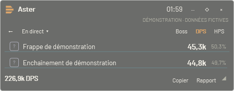
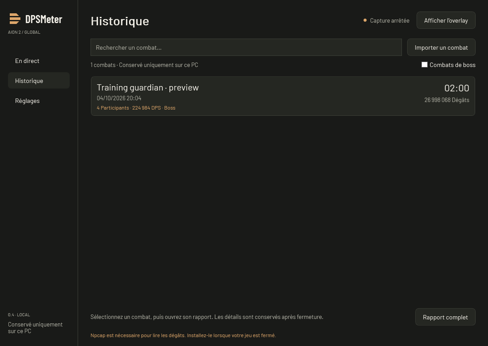

<p align="center">
  <picture>
    <source media="(prefers-color-scheme: dark)" srcset="brand/logo-dark.svg">
    <source media="(prefers-color-scheme: light)" srcset="brand/logo-light.svg">
    
  </picture>
</p>

<h1 align="center">Le combat, en clair.</h1>

<p align="center">
  <strong>Votre DPS meter pour AION 2 Global.</strong><br>
  Suivez vos dégâts et vos soins en jeu, explorez vos compétences et retrouvez vos combats.
</p>

<p align="center">
  Windows x64 · Français / English / Español · 3 thèmes · Historique local
</p>

<p align="center">
  <a href="#installation">Installer</a> ·
  <a href="#aperçu">Voir l’interface</a> ·
  <a href="#détail-des-sorts">Détail des sorts</a> ·
  <a href="#premier-combat">Premier combat</a> ·
  <a href="#questions-fréquentes">Questions fréquentes</a> ·
  <a href="https://github.com/Phobie53/DPSMeter/issues">Signaler un problème</a>
</p>

---

## Aperçu

### Le classement en jeu

**Pendant le combat : l’essentiel, sans quitter le jeu.** L’overlay discret affiche une ligne par joueur observé, avec son DPS et sa contribution. Sa hauteur s’adapte au classement et les valeurs sont abrégées pour rester lisibles. Survolez un joueur pour retrouver ses dégâts totaux, ses critiques observés et ses principales compétences.

<p align="center">
  
</p>

### Détail des sorts

**Cliquez sur un joueur : ses sorts remplacent le classement dans l’overlay.** Chaque ligne indique le DPS du sort et sa part dans les dégâts de ce joueur. La flèche **←** ramène au classement. Le total en bas reste celui de l’ensemble des participants observés.

<p align="center">
  
</p>

**Cliquez sur un sort ou sur Rapport pour ouvrir l’analyse complète.** Le joueur et le périmètre choisis dans l’overlay sont conservés. Dans l’application, un clic sur un autre joueur actualise le panneau **Compétences** ; le champ de recherche permet de retrouver un sort par son nom.


| Pour chaque sort | Ce que vous lisez dans le rapport |
| --- | --- |
| **Dégâts** | Le total infligé par ce sort sur le périmètre sélectionné, ticks compris. |
| **Contribution (%)** | La part de ce sort dans les dégâts du joueur sélectionné. |
| **DPS** | Les dégâts du sort divisés par la durée du combat retenue pour ce périmètre. |
| **Coups** | Le nombre d’impacts observés hors ticks ; ce n’est pas un compteur de lancements. |
| **Ticks** | Le nombre d’événements périodiques observés, comptés séparément des coups. |
| **Critiques (%)** | La proportion de coups critiques observés, hors ticks. |

Dans cet exemple fictif, **Flamme de démonstration** représente **4 130 091 dégâts**, soit **50,2 %** des dégâts de Lyra et **34 707 DPS**. Les **50,0 % de critiques** concernent les 60 coups de ce sort, pas sa contribution au total.

Le résumé au-dessus des sorts donne les dégâts, les coups, les critiques, le **plus gros impact** et l’**impact moyen** du joueur sur le périmètre affiché. Les deux dernières valeurs portent sur les événements reçus, ticks compris. L’onglet **Soins** propose la même lecture avec les soins bruts et le HPS. Dépliez **Rythme du combat** pour afficher la courbe des participants observés ou du joueur sélectionné.

### Retrouver un combat

**L’historique conserve vos rapports sur votre PC.** Recherchez un boss ou un joueur, filtrez les combats de boss, puis double-cliquez sur un combat ou sélectionnez **Rapport complet** pour retrouver le classement et les sorts. Vous pouvez consulter une archive pendant que la capture continue.

<details>
<summary><strong>Voir l’historique</strong></summary>



</details>

> Captures régénérées depuis la version **0.4.13**, en français et avec le thème Graphite. Elles utilisent exclusivement des **données fictives de démonstration**, y compris les noms de sorts et leurs icônes génériques. Elles ne représentent ni une performance réelle ni un classement de classes.

| Pendant votre session | Pour analyser votre progression |
| --- | --- |
| **DPS et HPS** — dégâts et soins par seconde | **Compétences** — contribution, coups, ticks et critiques observés |
| **Boss ou toutes les cibles** — choisissez le périmètre | **Rythme du combat** — courbe du groupe observé ou d’un joueur |
| **Overlay discret** — compact, déplaçable, clics traversants | **Historique** — recherche par boss ou joueur, filtre des combats de boss |
| **Trois thèmes** — Graphite, Ivoire, Contraste élevé | **Import / export** — fichiers JSON v2, export sans les noms |
| **Réduction automatique** — barre de titre après deux minutes hors combat | **Copier** — résumé compact dans la langue de l’interface, prêt pour le chat du jeu |

## Installation

### Ce qu’il vous faut

- **Windows x64** et AION 2 Global.
- **Npcap** pour lire les combats : l’assistant de premier lancement vous guide s’il manque. Il s’installe séparément, une seule fois.
- Le jeu en **mode fenêtré ou sans bordure** pour utiliser l’overlay de bureau au premier plan.

L’exécutable est autonome : **aucune installation de .NET n’est nécessaire pour jouer**.

### Télécharger et lancer

1. Téléchargez **DPSMeter.exe** depuis la [dernière release](https://github.com/Phobie53/DPSMeter/releases/latest) et placez-le dans un dossier personnel.
2. Ouvrez l’exécutable. Si Npcap manque, l’assistant vous invite à fermer le jeu et à télécharger son installateur depuis le site officiel.
3. Installez Npcap, revenez dans DPSMeter et cliquez sur **Vérifier l’installation**, puis **Continuer**. Lancez ensuite le jeu.

Npcap déjà présent ? L’assistant est ignoré. **Plus tard** permet de consulter les archives et réglages sans capture ; **Démarrer** rouvre l’assistant si Npcap manque encore. Sa détection ne garantit pas à elle seule la réception des combats.

L’application n’est pas encore signée : Windows peut afficher un avertissement de sécurité. Vérifiez que le fichier provient bien de ce dépôt.

<details>
<summary><strong>Mises à jour : à partir de la version 0.4.6</strong></summary>

La version 0.4.6 introduit la recherche de nouvelles releases stables au démarrage, leur téléchargement en arrière-plan et leur installation au lancement suivant. Aucun redémarrage n’est imposé ; les combats et préférences sont conservés.

La première installation de cette version doit être manuelle : les versions 0.4.5 et antérieures ne disposent pas du mécanisme. L’installation des mises à jour nécessite un dossier accessible en écriture. Sans réseau ou sans release disponible, le meter reste utilisable.

</details>

## Premier combat

1. **Lancez DPSMeter.** La capture et l’overlay démarrent automatiquement avec les réglages par défaut. Aucun redémarrage du jeu n’est nécessaire.
2. **Jouez normalement.** Les données apparaissent lorsque des événements de combat sont reçus. Choisissez **DPS** ou **HPS** et le périmètre **Boss** ou **Toutes les cibles**.
3. **Explorez une ligne.** Le survol donne un résumé ; un clic ouvre les compétences du joueur. Cliquez sur un sort ou sur **Rapport** pour ouvrir l’analyse détaillée.
4. **Retrouvez votre combat.** Au repos, il est sauvegardé dans **Historique**. En monde ouvert, le délai est de 12 secondes sans activité personnelle pertinente si votre personnage est identifié ; le farm alentour ne le prolonge pas. Pour un boss engagé, les dégâts des participants sur ce boss maintiennent le combat, et une reprise après une phase silencieuse complète la même archive. La capture continue pendant que vous consultez un ancien rapport.

Dans **Réglages**, choisissez la langue, le thème et, si vous le souhaitez, le nom de votre personnage. Ce nom s’applique à la prochaine capture.

### Les gestes utiles de l’overlay

| Vous voulez… | Faites ceci |
| --- | --- |
| Afficher ou masquer le meter | **`Ctrl+Alt+M`**, ou **Afficher / Masquer l’overlay** dans l’application |
| Le déplacer | Glissez sa barre de titre ; maintenez **Maj** pour désactiver temporairement l’aimantation |
| Changer sa taille | Glissez le coin inférieur droit ; double-cliquez sur le titre pour le mode compact |
| Cliquer dans le jeu à travers le meter | Activez le verrouillage **◇** ; masquez puis réaffichez avec **`Ctrl+Alt+M`** pour le déverrouiller |
| Le repositionner | Ouvrez **···** pour les coins et le centre, ou **Réglages → Recentrer l’overlay** |
| Consulter un ancien combat | Ouvrez le menu **En direct ▾** de l’overlay |
| Voir les sorts d’un joueur | Cliquez sur sa ligne ; **←** ramène au classement |
| Ouvrir le détail des dégâts par sort | Depuis les sorts, cliquez sur une ligne ou sur **Rapport** |
| Copier le résumé du combat | Cliquez sur **Copier** dans l’overlay ou le rapport |

La position et la taille sont mémorisées. Par défaut, l’overlay passe à **15 % d’opacité hors combat**, après 12 secondes sans événement, puis redevient lisible au combat ou au survol lorsqu’il est déverrouillé. La lecture d’un combat archivé reste lisible. L’option se règle dans **··· → Presque transparent hors combat**.

Après **deux minutes hors combat**, il se réduit à sa barre de titre. Le survol ne le déplie pas : utilisez le bouton flèche pour deux nouvelles minutes de lecture, ou laissez le prochain combat restaurer sa taille. Les archives restent dépliées. Le menu **···** permet aussi de quitter la présentation discrète pour retrouver les lignes détaillées.

## Comprendre vos chiffres

**Le DPS dépend de la cible choisie.** Sur un boss, il utilise la durée entre le premier et le dernier dégât des joueurs sur ce boss, avec un minimum d’une seconde. L’attente des 12 secondes de fin de combat ne fait pas baisser le résultat. Les pauses entre les attaques restent incluses. En mode toutes les cibles, le calcul utilise le premier et le dernier événement du segment.

- **Soins :** valeurs brutes, sans déduction du sursoin. Le HPS ne mesure donc pas les seuls soins utiles.
- **Critiques :** statistiques observées ; les données des autres joueurs peuvent être incomplètes.
- **Ticks :** leurs dégâts sont comptés sans augmenter artificiellement le nombre de coups ou de critiques.
- **Participants :** joueurs identifiés dans le flux reçu, pas une composition de groupe confirmée. Des noms ou des PV peuvent manquer.
- **Sources à identifier :** certaines sources anonymes restent séparées des joueurs. Leurs dégâts restent dans le total et leurs détails sont consultables ; aucun propriétaire n’est deviné.

Les buffs, leur durée d’activité, les attaques de dos/de face, les doubles et les coups parfaits ne sont pas encore exposés. Sans boss identifié, 12 secondes sans activité pertinente peuvent séparer une rencontre en plusieurs combats. Pour un boss, une mort ou un reset non reçu peut au contraire fusionner des tentatives ; une remontée complète de ses PV peut être prise pour un reset. La reprise d’un boss ne traverse pas le redémarrage du meter. Une mise à jour du jeu peut nécessiter une adaptation du décodeur.

## Questions fréquentes

### Aucun dégât ne s’affiche : que vérifier ?

Vérifiez que Npcap est installé, que la capture n’est pas en pause et que des événements de combat se produisent. Consultez l’état de capture dans l’application. En cas de problème persistant, [ouvrez un signalement](https://github.com/Phobie53/DPSMeter/issues/new?template=bug_report.md) avec votre version et le message affiché, sans données privées.

### Pourquoi certains joueurs ou boss n’ont-ils pas de nom ?

Si le meter démarre en cours de partie, il peut devoir attendre que le jeu renvoie leur identité. Il conserve les dégâts reçus sans inventer les informations manquantes.

### Où sont mes combats ?

Ils restent sur votre PC, dans `%LOCALAPPDATA%\DPSMeter\fights\`. Les préférences sont dans `%LOCALAPPDATA%\DPSMeter\settings.json`. Aucun combat n’est supprimé automatiquement ; une collection très volumineuse peut demander plus de temps à charger.

### Puis-je partager un rapport ?

Oui. **Copier**, dans l’overlay ou le rapport, place dans le presse-papiers une ligne compacte avec la cible, la durée, le DPS ou HPS global et le classement, selon le filtre affiché et dans la langue de l’interface. Les valeurs sont abrégées en k/M et les noms sont conservés. Collez-la ensuite vous-même dans le chat du jeu.

Pour transmettre le fichier complet, **Exporter sans les noms** produit un JSON v2 qui remplace les noms et identifiants des joueurs. Vous choisissez ensuite où partager ce fichier ; DPSMeter ne l’envoie pas en ligne. Les sauvegardes locales, elles, conservent les noms. L’import accepte le format v2 de ce projet et le marque non vérifié ; les fichiers NotMeter et ceux de l’ancien prototype v1 ne sont pas pris en charge.

### Que font « Pause » et « Nouveau combat » ?

**Pause** ignore les événements reçus pendant la pause : ils ne seront pas rejoués. **Nouveau combat** archive le segment actuel ; le suivant commence au prochain événement.

### Est-ce un outil officiel ou approuvé par NCSOFT ?

Non. DPSMeter est un **projet indépendant**, sans approbation de NCSOFT revendiquée. Il utilise une capture passive via Npcap : aucune injection, lecture de mémoire du jeu, modification de paquets, automatisation du gameplay ou contournement de protection. Cette méthode ne garantit pas la conformité aux règles du jeu.

### Mes données sont-elles envoyées sur Internet ?

**Aucune télémétrie ni aucun envoi automatique de combats.** L’application ne conserve pas les paquets bruts, les IP ou le compte du jeu. Le mécanisme de mise à jour de la version 0.4.6 contacte GitHub pour les versions et téléchargements, sans transmettre de données de combat. Il n’y a pas de site communautaire ni de classement en ligne intégré.

## Contribuer au projet

Un problème ou une idée ? [Ouvrez une issue](https://github.com/Phobie53/DPSMeter/issues). Indiquez la version utilisée, ce que vous attendiez et ce que vous avez observé. Ne joignez pas de combat réel, de trafic réseau brut ni de capture contenant des informations privées.

<details>
<summary><strong>Développeurs : documentation et vérifications</strong></summary>

Prérequis : Windows et SDK .NET 9. Une migration LTS reste à planifier.

Lisez le [guide de reprise](docs/HANDOFF.md) et le [guide de contribution](CONTRIBUTING.md) avant de modifier le projet.

```powershell
powershell -NoProfile -File tools/Verify.ps1
```

Ce script restaure les dépendances verrouillées, compile, vérifie les calculs et le protocole, produit l’exécutable et contrôle l’interface hors écran dans les trois langues et les trois thèmes. Il ne lance pas de capture et n’interagit pas avec le jeu. Les résultats restent dans `artifacts/`, ignoré par Git. Ces contrôles ne certifient pas l’intégralité du protocole.

- [Architecture](docs/ARCHITECTURE.md)
- [Format des combats JSON v2](docs/FORMAT.md)
- [Décisions techniques](docs/DECISIONS.md)
- [Identité graphique et ressources](brand/README.md)
- [Vérifications automatiques sur GitHub](https://github.com/Phobie53/DPSMeter/actions/workflows/build.yml)

</details>

---

Code du projet sous [licence MIT](LICENSE). Visuels et données AION 2 : © NCSOFT, hors licence MIT du projet. Moteur dérivé de SkeeveTV sous MIT, PacketDotNet sous MPL-2.0 et polices Barlow sous SIL OFL 1.1. Voir les [notices tierces](THIRD-PARTY-NOTICES.md) et l’[origine du moteur](src/DPSMeter.Engine/Vendor/ORIGIN.md).
