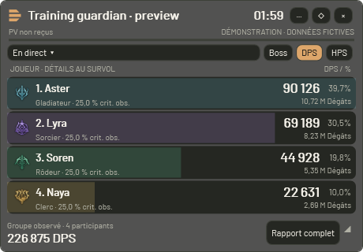
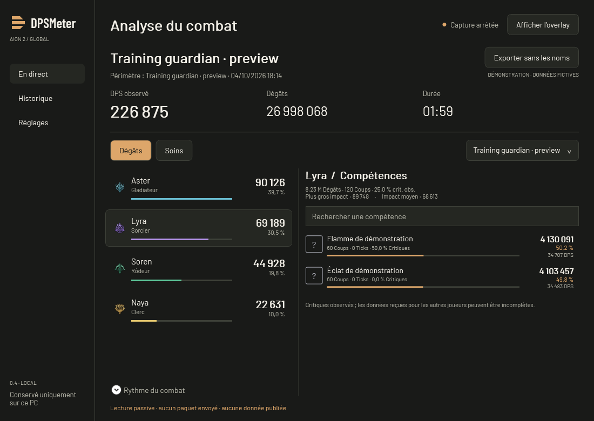

<p align="center">
  <picture>
    <source media="(prefers-color-scheme: dark)" srcset="brand/logo-dark.svg">
    <source media="(prefers-color-scheme: light)" srcset="brand/logo-light.svg">
    
  </picture>
</p>

<h1 align="center">Le combat, en clair.</h1>

<p align="center">
  <strong>Votre DPS meter pour AION 2 Global.</strong><br>
  Suivez vos dégâts et vos soins en jeu, explorez vos compétences et retrouvez vos combats.
</p>

<p align="center">
  Windows x64 · Français / English / Español · 3 thèmes · Historique local
</p>

<p align="center">
  <a href="#installation">Installer</a> ·
  <a href="#aperçu">Voir l’interface</a> ·
  <a href="#premier-combat">Premier combat</a> ·
  <a href="#questions-fréquentes">Questions fréquentes</a> ·
  <a href="https://github.com/Phobie53/DPSMeter/issues">Signaler un problème</a>
</p>

---

## Aperçu

**Pendant le combat : l’essentiel, sans quitter le jeu.** Un overlay compact affiche le DPS, les dégâts et la contribution de chaque joueur observé. Survolez une ligne pour en savoir plus, cliquez pour explorer ses compétences.

<p align="center">
  
</p>

**Après le combat : comprenez ce qui a fait la différence.** Retrouvez le détail des compétences, les critiques observés, les soins et le rythme du combat dans un rapport conservé sur votre PC.



> Ces aperçus utilisent exclusivement des **données fictives de démonstration**. Ils ne représentent ni une performance réelle ni un classement de classes.

| Pendant votre session | Pour analyser votre progression |
| --- | --- |
| **DPS et HPS** — dégâts et soins par seconde | **Compétences** — contribution, coups, ticks et critiques observés |
| **Boss ou toutes les cibles** — choisissez le périmètre | **Rythme du combat** — courbe du groupe observé ou d’un joueur |
| **Overlay discret** — compact, déplaçable, clics traversants | **Historique** — recherche par boss ou joueur, filtre des combats de boss |
| **Trois thèmes** — Graphite, Ivoire, Contraste élevé | **Import / export** — fichiers JSON v2, export sans les noms |

## Installation

### Ce qu’il vous faut

- **Windows x64** et AION 2 Global.
- **Npcap déjà installé** sur le PC : il permet la capture passive et n’est pas fourni avec DPSMeter.
- Le jeu en **mode fenêtré ou sans bordure** pour utiliser l’overlay de bureau au premier plan.

L’exécutable est autonome : **aucune installation de .NET n’est nécessaire pour jouer**.

### Télécharger et lancer

Les versions destinées aux joueurs seront disponibles sur la page [Releases](https://github.com/Phobie53/DPSMeter/releases).

**En attendant la première release**, un build de développement est disponible dans GitHub Actions :

1. Connectez-vous à GitHub et ouvrez [Build and verify](https://github.com/Phobie53/DPSMeter/actions/workflows/build.yml).
2. Choisissez une exécution **réussie sur `main`**, puis téléchargez **DPSMeter-windows-x64** dans la section **Artifacts**.
3. Extrayez le ZIP dans un dossier personnel, puis ouvrez **`DPSMeter.exe`**.

Les artefacts expirent après 14 jours. Ce sont des builds de développement, pas des versions stables. L’application n’est pas encore signée : Windows peut afficher un avertissement de sécurité. Vérifiez que le fichier provient bien de ce dépôt.

<details>
<summary><strong>Mises à jour : à partir de la version 0.4.6</strong></summary>

La version 0.4.6 introduit la recherche de nouvelles releases stables au démarrage, leur téléchargement en arrière-plan et leur installation au lancement suivant. Aucun redémarrage n’est imposé ; les combats et préférences sont conservés.

La première installation de cette version doit être manuelle : les versions 0.4.5 et antérieures ne disposent pas du mécanisme. L’installation des mises à jour nécessite un dossier accessible en écriture. Sans réseau ou sans release disponible, le meter reste utilisable.

</details>

## Premier combat

1. **Lancez DPSMeter.** La capture et l’overlay démarrent automatiquement avec les réglages par défaut. Aucun redémarrage du jeu n’est nécessaire.
2. **Jouez normalement.** Les données apparaissent lorsque des événements de combat sont reçus. Choisissez **DPS** ou **HPS** et le périmètre **Boss** ou **Toutes les cibles**.
3. **Explorez une ligne.** Le survol donne un résumé ; un clic ouvre les compétences du joueur. **Rapport complet** ouvre l’analyse détaillée.
4. **Retrouvez votre combat.** Après 12 secondes sans événement, il est archivé dans **Historique**. La capture continue pendant que vous consultez un ancien rapport.

Dans **Réglages**, choisissez la langue, le thème et, si vous le souhaitez, le nom de votre personnage. Ce nom s’applique à la prochaine capture.

### Les gestes utiles de l’overlay

| Vous voulez… | Faites ceci |
| --- | --- |
| Afficher ou masquer le meter | **`Ctrl+Alt+M`**, ou **Afficher / Masquer l’overlay** dans l’application |
| Le déplacer | Glissez sa barre de titre ; maintenez **Maj** pour désactiver temporairement l’aimantation |
| Changer sa taille | Glissez le coin inférieur droit ; double-cliquez sur le titre pour le mode compact |
| Cliquer dans le jeu à travers le meter | Activez le verrouillage **◇** ; masquez puis réaffichez avec **`Ctrl+Alt+M`** pour le déverrouiller |
| Le repositionner | Ouvrez **···** pour les coins et le centre, ou **Réglages → Recentrer l’overlay** |
| Consulter un ancien combat | Ouvrez le menu **En direct ▾** de l’overlay |

La position et la taille sont mémorisées. Par défaut, l’overlay passe à **15 % d’opacité hors combat**, après 12 secondes sans événement, puis redevient lisible au combat ou au survol lorsqu’il est déverrouillé. La lecture d’un combat archivé reste lisible. L’option se règle dans **··· → Presque transparent hors combat**.

## Comprendre vos chiffres

**Le DPS dépend de la cible choisie.** Sur un boss, il utilise la durée entre le premier et le dernier dégât des joueurs sur ce boss, avec un minimum d’une seconde. L’attente des 12 secondes de fin de combat ne fait pas baisser le résultat. Les pauses entre les attaques restent incluses. En mode toutes les cibles, le calcul utilise le premier et le dernier événement du segment.

- **Soins :** valeurs brutes, sans déduction du sursoin. Le HPS ne mesure donc pas les seuls soins utiles.
- **Critiques :** statistiques observées ; les données des autres joueurs peuvent être incomplètes.
- **Ticks :** leurs dégâts sont comptés sans augmenter artificiellement le nombre de coups ou de critiques.
- **Participants :** joueurs identifiés dans le flux reçu, pas une composition de groupe confirmée. Des noms ou des PV peuvent manquer.
- **Sources à identifier :** certaines sources anonymes restent séparées des joueurs. Leurs dégâts restent dans le total et leurs détails sont consultables ; aucun propriétaire n’est deviné.

Les buffs, leur durée d’activité, les attaques de dos/de face, les doubles et les coups parfaits ne sont pas encore exposés. Une phase de 12 secondes sans événement peut séparer une rencontre en plusieurs combats. Une mise à jour du jeu peut nécessiter une adaptation du décodeur.

## Questions fréquentes

### Aucun dégât ne s’affiche : que vérifier ?

Vérifiez que Npcap est installé, que la capture n’est pas en pause et que des événements de combat se produisent. Consultez l’état de capture dans l’application. En cas de problème persistant, [ouvrez un signalement](https://github.com/Phobie53/DPSMeter/issues/new?template=bug_report.md) avec votre version et le message affiché, sans données privées.

### Pourquoi certains joueurs ou boss n’ont-ils pas de nom ?

Si le meter démarre en cours de partie, il peut devoir attendre que le jeu renvoie leur identité. Il conserve les dégâts reçus sans inventer les informations manquantes.

### Où sont mes combats ?

Ils restent sur votre PC, dans `%LOCALAPPDATA%\DPSMeter\fights\`. Les préférences sont dans `%LOCALAPPDATA%\DPSMeter\settings.json`. Aucun combat n’est supprimé automatiquement ; une collection très volumineuse peut demander plus de temps à charger.

### Puis-je partager un rapport ?

Oui, avec **Exporter sans les noms** : l’export JSON v2 remplace les noms et identifiants des joueurs. Vous choisissez ensuite où partager ce fichier ; DPSMeter ne l’envoie pas en ligne. Les sauvegardes locales, elles, conservent les noms. L’import accepte le format v2 de ce projet et le marque non vérifié ; les fichiers NotMeter et ceux de l’ancien prototype v1 ne sont pas pris en charge.

### Que font « Pause » et « Nouveau combat » ?

**Pause** ignore les événements reçus pendant la pause : ils ne seront pas rejoués. **Nouveau combat** archive le segment actuel ; le suivant commence au prochain événement.

### Est-ce un outil officiel ou approuvé par NCSOFT ?

Non. DPSMeter est un **projet indépendant**, sans approbation de NCSOFT revendiquée. Il utilise une capture passive via Npcap : aucune injection, lecture de mémoire du jeu, modification de paquets, automatisation du gameplay ou contournement de protection. Cette méthode ne garantit pas la conformité aux règles du jeu.

### Mes données sont-elles envoyées sur Internet ?

**Aucune télémétrie ni aucun envoi automatique de combats.** L’application ne conserve pas les paquets bruts, les IP ou le compte du jeu. Le mécanisme de mise à jour de la version 0.4.6 contacte GitHub pour les versions et téléchargements, sans transmettre de données de combat. Il n’y a pas de site communautaire ni de classement en ligne intégré.

## Contribuer au projet

Un problème ou une idée ? [Ouvrez une issue](https://github.com/Phobie53/DPSMeter/issues). Indiquez la version utilisée, ce que vous attendiez et ce que vous avez observé. Ne joignez pas de combat réel, de trafic réseau brut ni de capture contenant des informations privées.

<details>
<summary><strong>Développeurs : documentation et vérifications</strong></summary>

Prérequis : Windows et SDK .NET 9. Une migration LTS reste à planifier.

Lisez [AGENTS.md](AGENTS.md), le [guide de reprise](docs/HANDOFF.md) et le [guide de contribution](CONTRIBUTING.md) avant de modifier le projet.

```powershell
powershell -NoProfile -File tools/Verify.ps1
```

Ce script restaure les dépendances verrouillées, compile, vérifie les calculs et le protocole, produit l’exécutable et contrôle l’interface hors écran dans les trois langues et les trois thèmes. Il ne lance pas de capture et n’interagit pas avec le jeu. Les résultats restent dans `artifacts/`, ignoré par Git. Ces contrôles ne certifient pas l’intégralité du protocole.

- [Architecture](docs/ARCHITECTURE.md)
- [Format des combats JSON v2](docs/FORMAT.md)
- [Décisions techniques](docs/DECISIONS.md)
- [Identité graphique et ressources](brand/README.md)
- [Vérifications automatiques sur GitHub](https://github.com/Phobie53/DPSMeter/actions/workflows/build.yml)

</details>

---

Code du projet sous [licence MIT](LICENSE). Visuels et données AION 2 : © NCSOFT, hors licence MIT du projet. Moteur dérivé de SkeeveTV sous MIT, PacketDotNet sous MPL-2.0 et polices Barlow sous SIL OFL 1.1. Voir les [notices tierces](THIRD-PARTY-NOTICES.md) et l’[origine du moteur](src/DPSMeter.Engine/Vendor/ORIGIN.md).
